# BlockChain_FP_ITStep

## Screenshots

### 1. Dashboard — Network & Economy stats + mining controls
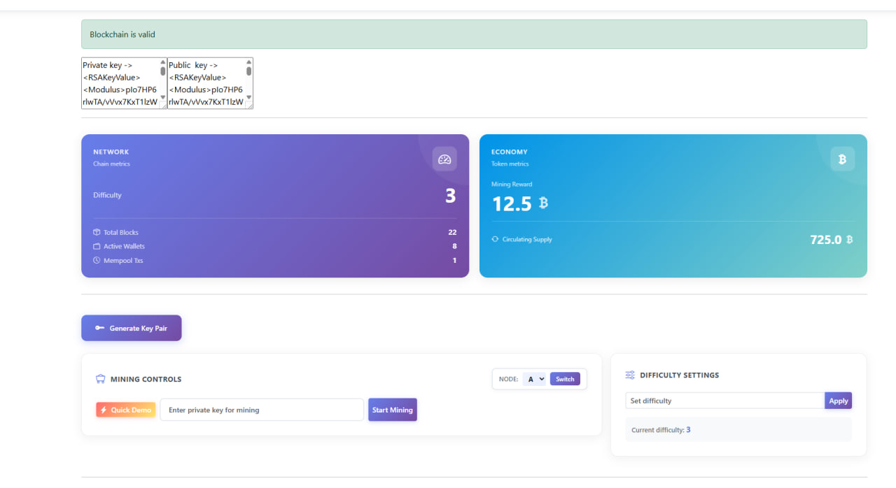

---

### 2. Staking Contract form (deposit / withdraw)
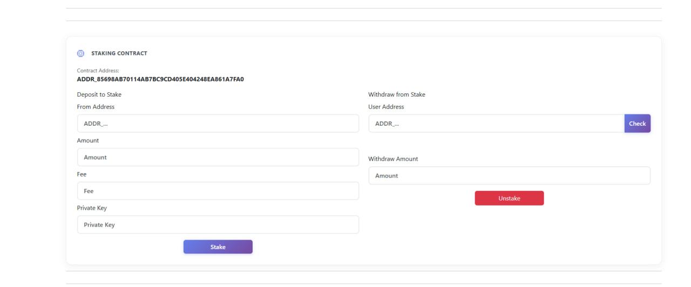

---

### 3. Memory pool + mined blocks list
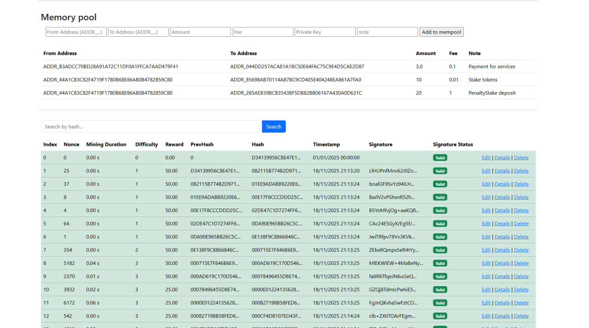

---

### 4. Staking Contract — user state (staked / reward / withdrawable)
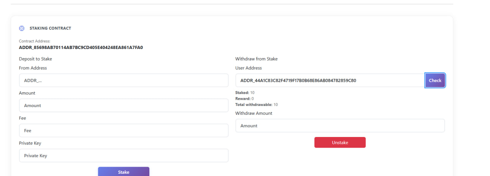

---

### 5. Penalty Staking Contract — deposit / withdraw
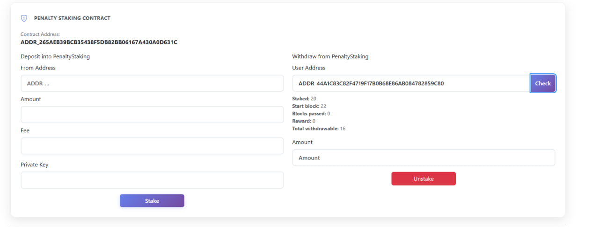

---

### 6. Both contracts — withdraw from Stake & PenaltyStaking
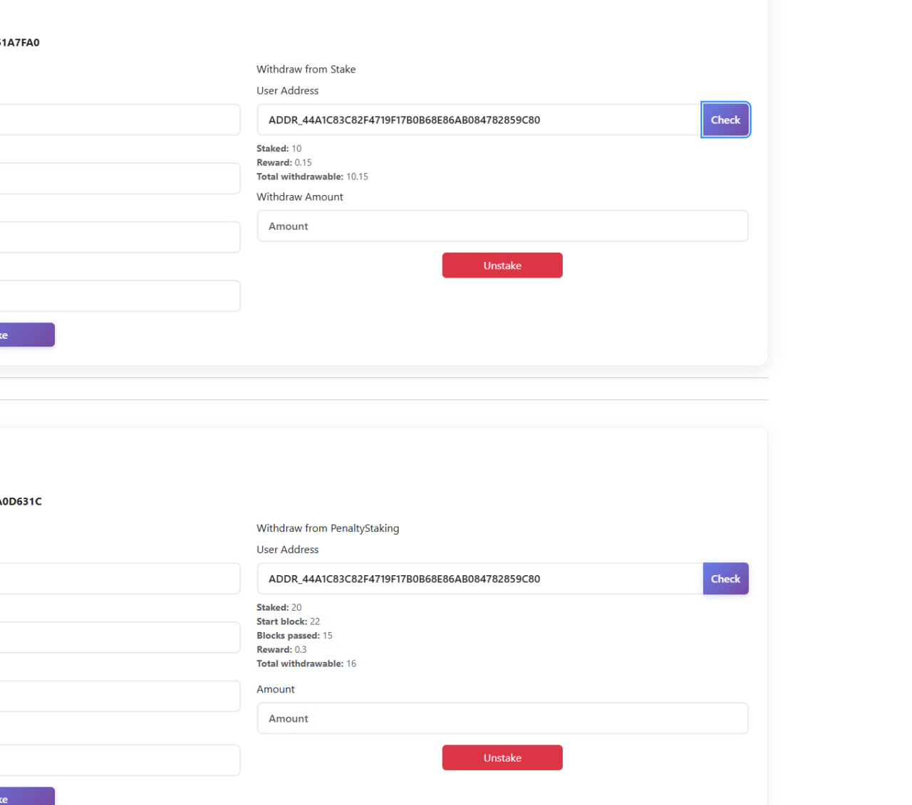

---

### 7. Wallet details — balance & transaction history
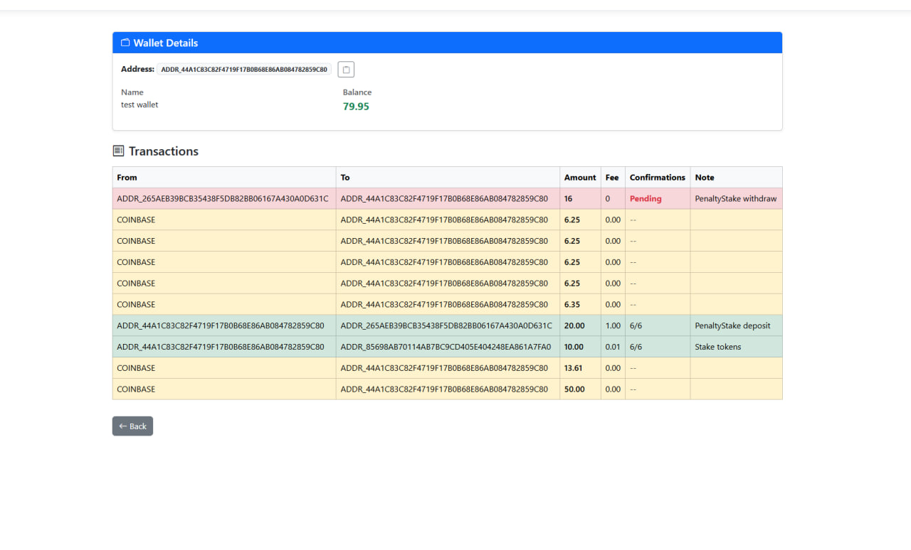

---

### 8. Block details — full block info + transactions
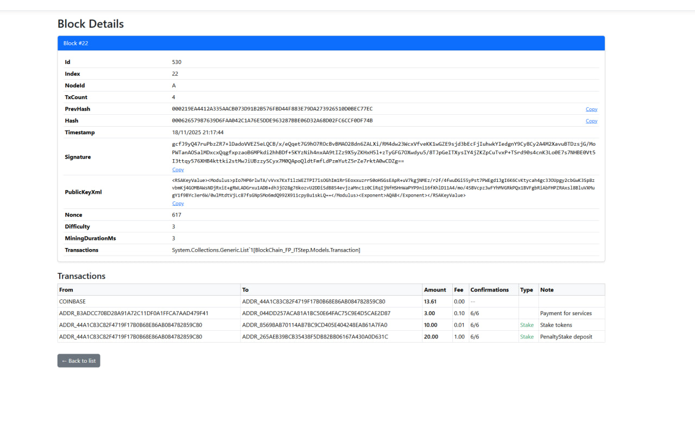

---

### 9. PenaltyStaking withdraw transactions \ Unstake 
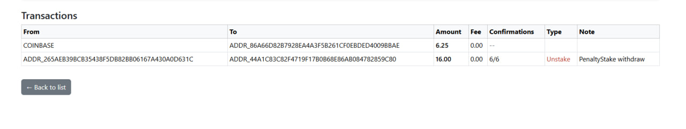

### 9. Staking withdraw transactions \ Unstake 
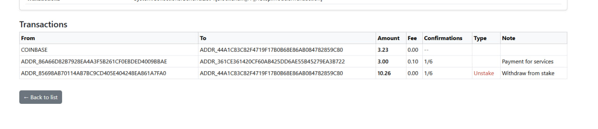

---

### 10. RSA key generator modal (private/public key)
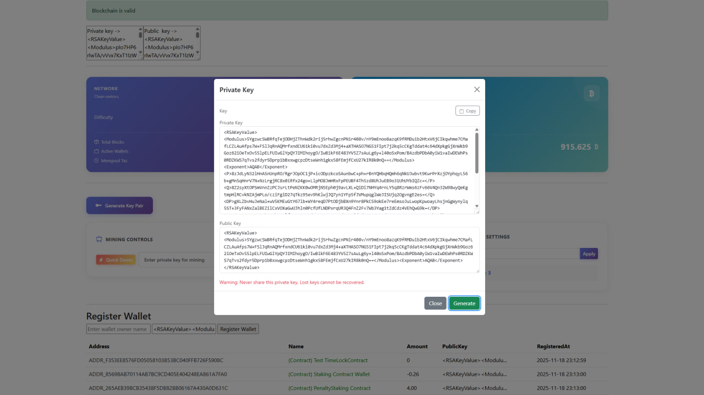

---

### 11. Mining progress bar (SignalR UI)

